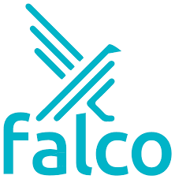
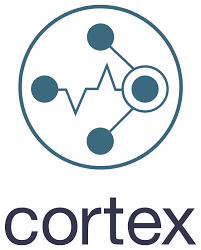
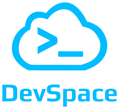

-   [Home](#)
-   [About](about.html)
-   [Link to website](https://akashshukla7458.github.io/CNCF/)

Cloud Native Computing Foundation 
=================================

The Cloud Native Computing Foundation (CNCF) is a Linux Foundation
project that was founded in 2015 to help advance container technology
and align the tech industry around its evolution.

CNCF Projects
-------------

CNCF technology projects are cataloged with a maturity level of Sandbox,
Incubated, and Graduated, in ascending order. The defined criteria
include rate of adoption, longevity and whether the open source project
can be relied upon to build a production-grade product. CNCF's process
brings projects in as incubated projects and then aims to move them
through to graduation, which implies a level of process and technology
maturity. A graduated project reflects overall maturity; these projects
have reached a tipping point in terms of diversity of contribution,
community scale/growth, and adoption.

-------------

##### Graduated projects

Containerd Containerd is an industry-standard core container runtime. It
is currently available as a daemon for Linux and Windows, which can
manage the complete container lifecycle of its host system. In 2015,
Docker donated the OCI Specification to The Linux Foundation with a
reference implementation called runc. Since February 28, 2019 it is an
official CNCF project. Its general availability and intention to donate
the project to CNCF was announced by Docker in 2017.

**CoreDNS**\
 CoreDNS is a DNS server that chains plugins. Its graduation was
announced in 2019. \
 
 **Envoy**\
  
 Originally built at Lyft to move their architecture away from a
monolith, Envoy is a high-performance open source edge and service proxy
that makes the network transparent to applications. Lyft contributed
Envoy to Cloud Native Computing Foundation in September 2017. \
 
 **etcd** \
  
 etcd is a distributed key value store, providing a method of storing
data across a cluster of machines.It became a CNCF incubating project in
2018 at KubeCon+CloudNativeCon North America in Seattle that year. In
November, 2020, the project became a graduated project. \
 
 **Fluentd**\
  
 Fluentd is an open source data collector, allowing the user to "unify
the data collection and consumption for a better use and understanding
of data." Fluentd joined CNCF in 2016 and became a graduated project in
2019. \
2020.  
 **Helm** \
  
 Helm is a package manager that helps developers "easily manage and
deploy applications onto the Kubernetes cluster." It joined the
incubating level in June 2018 and graduated in April 2020. \
 
 **Jaeger** \
  
 Created by Uber Engineering, Jaeger is an open source distributed
tracing system inspired by Google Dapper paper and OpenZipkin community.
It can be used for tracing microservice-based architectures, including
distributed context propagation, distributed transaction monitoring,
root cause analysis, service dependency analysis, and
performance/latency optimization. The Cloud Native Computing Foundation
Technical Oversight Committee voted to accept Jaeger as the 12th hosted
project in September 2017 and became a graduated project in 2019. In
2020 it became an approved and fully integrated part of the CNCF
ecosystem. \
 
 **Kubernetes** \
  
 Kubernetes is an open source framework for automating deployment and
managing applications in a containerized and clustered environment. "It
aims to provide better ways of managing related, distributed components
across varied infrastructure." It was originally designed by Google and
donated to The Linux Foundation to form the Cloud Native Computing
Foundation with Kubernetes as the seed technology.[34] The "large and
diverse" community supporting the project has made its staying power
more robust than other, older technologies of the same ilk. In January
2020, the CNCF annual report showed significant growth in interest,
training, event attendance and investment related to Kubernetes.

Definition of CNCF 
------------------

Cloud native technologies empower organizations to build and run
scalable applications in modern, dynamic environments such as public,
private, and hybrid clouds. Containers, service meshes, microservices,
immutable infrastructure, and declarative APIs exemplify this approach.
These techniques enable loosely coupled systems that are resilient,
manageable, and observable. Combined with robust automation, they allow
engineers to make high-impact changes frequently and predictably with
minimal toil. The Cloud Native Computing Foundation seeks to drive
adoption of this paradigm by fostering and sustaining an ecosystem of
open source, vendor-neutral projects. We democratize state-of-the-art
patterns to make these innovations accessible for everyone.

  

CNCF Initiatives
----------------

CNCF hosts a number of efforts and initiatives to serve the cloud native
community, including:

\
 \

### Events

CNCF hosts the co-located KubeCon and CloudNativeCon conferences, which
have become a keystone events for technical users and business
professionals seeking to increase Kubernetes and cloud-native knowledge.
The events seek to enable collaboration with industry peers and thought
leaders.The North America event was moved to an entirely remote model
for its 2020 season due to the COVID-19 pandemic.

#### Diversity scholarships and stance on equity and inclusion

CNCF's Diversity Scholarship program covers the ticket and travel to the
KubeCon + CloudNativeCon conference. In 2018, \$300,000 in diversity
scholarships was raised to enable attendees from diverse and minority
backgrounds to make the journey to Seattle for KubeCon and
CloudNativeCon. In August 2020, Priyanka Sharma stated that CNCF stands
"in solidarity" with the Black Lives Matter movement. Sharma also stated
that she was "personally involved in a project to eradicate racially
problematic terminology from code" and that the foundation is "actively
working to improve the gender and racial balance inside the cloud native
ecosystem" while remaining committed to creating spaces and
opportunities for LGBTQIA+, women, Black and Brown people, and
differently-abled people, specifically in regards to KubeCon.
